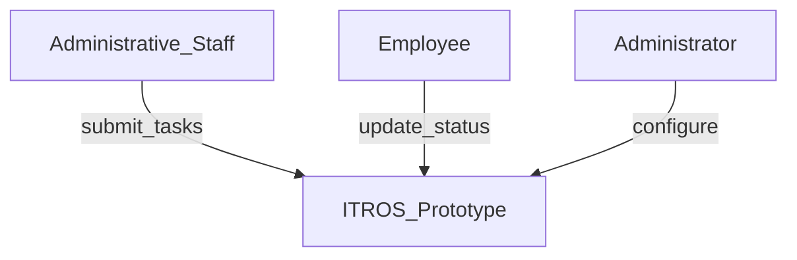
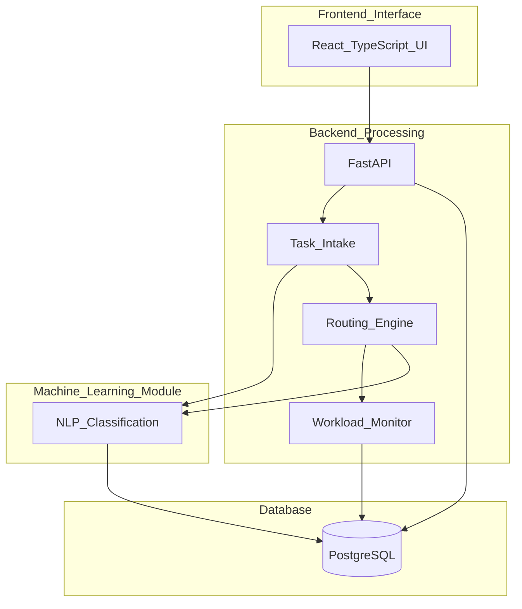
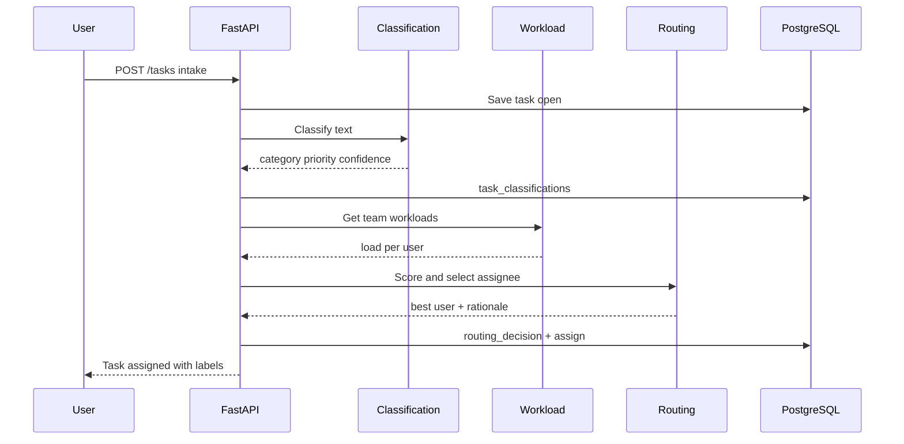

# 1. System Overview

**Source:** [specification-extract.md](specification-extract.md)

## 1.1 Vision

ITROS implements the diploma specification: an **Intelligent Task Routing and Workload Optimization System for Office Environments** that **automatically classifies, prioritizes, and routes** office tasks using NLP and workload analysis.

The prototype demonstrates how AI and optimization improve productivity versus manual tools (Trello, Asana, Jira, Microsoft Planner) that only visualize work without intelligent assignment.

## 1.2 Purpose (from specification)

| Goal | ITROS response |
|------|----------------|
| Reduce unbalanced task distribution | Workload monitoring + load-balanced routing scores |
| Reduce manual assignment | Automatic routing after classification |
| Reduce delays from poor prioritization | NLP priority inference + priority-weighted routing |
| Support administrative office teams | Department-based users, simple task UI |
| Handle tasks from multiple sources | Intake channels: `manual`, `form`, `email`, `internal` (v1: UI/API; live integrations optional later) |

## 1.3 Problem statement

Organizations receive tasks via email, forms, and internal systems. Assignment is often manual, leading to:

- Uneven workload across employees
- Slow triage of unstructured descriptions
- Suboptimal priority handling
- No audit trail for why someone was chosen

ITROS centralizes intake, enriches tasks with scikit-learn–based classification, monitors workload, and routes to the most suitable employee.

## 1.4 Stakeholders

| Stakeholder | Interest |
|-------------|----------|
| **Administrative staff** | Submit tasks, monitor status (spec: simple UI) |
| **Employees** | Receive routed work, update progress |
| **Team leads / managers** | Override routing, view workload |
| **System administrator** | Users, departments, model configuration |
| **Evaluators** | Metrics: distribution efficiency, processing time, accuracy |

## 1.5 System boundaries

### In scope (prototype)

- Four specification modules: **intake**, **classification**, **workload monitoring**, **routing**
- Automatic classify → prioritize → route pipeline on task intake
- PostgreSQL persistence; FastAPI backend; React UI
- Evaluation harness for thesis metrics

### Out of scope (prototype v1)

- Production connectors to Microsoft 365 / Gmail (simulated via intake channel metadata)
- Multi-tenant SaaS
- Full parity with Jira/Asana feature sets (boards, sprints, etc.)

## 1.6 Context diagram

## 1.7 Container diagram (modular architecture per spec)

## 1.8 Specification modules

| Module | Responsibility | Primary doc |
|--------|----------------|-------------|
| **M1 Task intake** | Accept title, description, source channel; persist task | 06-backend, 10-rest-api |
| **M2 Text classification** | Category + priority from NLP | 08-nlp-classification-module |
| **M3 Workload monitoring** | Per-employee active load metrics | 05-database-schema, 09-workload-optimization |
| **M4 Intelligent routing** | Select assignee; apply assignment | 09-workload-optimization-algorithm |

## 1.9 Core workflow (automatic pipeline)

**Override path:** Manager or admin may reassign via `PATCH /tasks/{id}/assignee` (FR-044).

## 1.10 Data flows

| Flow | Data |
|------|------|
| Intake | title, description, intake_channel, optional deadline |
| Classification | text → category, priority, confidence |
| Workload | user_id → active_count, effort_sum |
| Routing | task + candidates → assignee_id, rationale JSON |
| Status | assigned → in_progress → completed |

## 1.11 Competitor positioning (from specification)

| Tool | Strength | Gap ITROS addresses |
|------|----------|---------------------|
| Trello / Asana / Planner | Usability, adoption | No automatic routing from text + workload |
| Jira | Engineering workflows | Manual assignment; heavy configuration |

ITROS focuses on **intelligent decision support**, not board visualization alone.

## 1.12 Deployment view

Docker Compose prototype: `api`, `db`, `frontend`. Suitable for thesis demo and evaluation runs.

## 1.13 Assumptions

| ID | Item |
|----|------|
| A-01 | English task text for v1 NLP |
| A-02 | Auto-route on intake is **default** (spec); manual override retained |
| A-03 | React + TypeScript satisfies spec “HTML, CSS, JavaScript” UI requirement |
