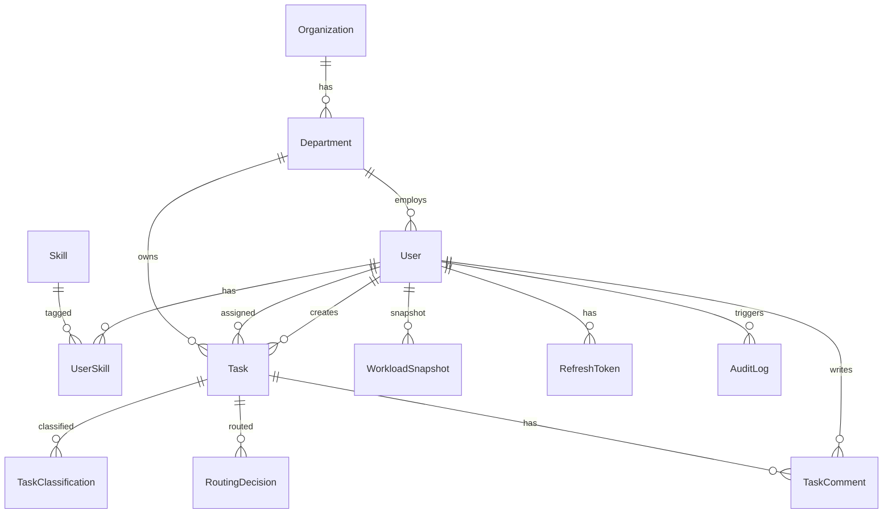

# 5. Database Schema

**Source:** [specification-extract.md](specification-extract.md) — tasks, users, workload metrics.

**DBMS:** PostgreSQL 16 (spec allows SQLite; PostgreSQL chosen for prototype realism).

## 5.1 ERD



## 5.2 Enumerations

```sql
-- role
CREATE TYPE user_role AS ENUM ('admin', 'manager', 'employee');

-- task lifecycle (monitoring)
CREATE TYPE task_status AS ENUM (
  'open', 'assigned', 'in_progress', 'completed', 'cancelled'
);

-- spec-aligned priority
CREATE TYPE task_priority AS ENUM ('low', 'medium', 'high', 'critical');

-- intake sources per specification
CREATE TYPE intake_channel AS ENUM ('manual', 'form', 'email', 'internal');

-- routing
CREATE TYPE routing_status AS ENUM ('suggested', 'applied', 'failed', 'overridden');
```

## 5.3 Table definitions

### organizations

| Column | Type | Notes |
|--------|------|-------|
| id | UUID PK | |
| name | VARCHAR(255) NOT NULL | |
| created_at | TIMESTAMPTZ | |
| updated_at | TIMESTAMPTZ | |

### departments

| Column | Type | Notes |
|--------|------|-------|
| id | UUID PK | |
| organization_id | UUID FK | |
| name | VARCHAR(255) NOT NULL | Unique per org |
| created_at | TIMESTAMPTZ | |

### users

| Column | Type | Notes |
|--------|------|-------|
| id | UUID PK | |
| organization_id | UUID FK | |
| department_id | UUID FK | |
| email | VARCHAR(255) UNIQUE | |
| password_hash | VARCHAR(255) | bcrypt |
| full_name | VARCHAR(255) | |
| role | user_role | |
| is_active | BOOLEAN DEFAULT true | |
| max_active_tasks | INT DEFAULT 10 | routing constraint |
| created_at | TIMESTAMPTZ | |
| updated_at | TIMESTAMPTZ | |

### skills / user_skills (optional enhancement)

| skills | id, slug, name |
| user_skills | user_id, skill_id, proficiency 1–5 |

### tasks

| Column | Type | Notes |
|--------|------|-------|
| id | UUID PK | |
| organization_id | UUID FK | |
| department_id | UUID FK | |
| created_by_id | UUID FK → users | Submitter |
| assigned_to_id | UUID FK NULL | Set by routing |
| title | VARCHAR(500) NOT NULL | |
| description | TEXT NOT NULL | NLP input |
| status | task_status | |
| priority | task_priority | Set from NLP |
| intake_channel | intake_channel | FR-015 |
| effort_points | INT DEFAULT 1 | Workload weight |
| deadline | TIMESTAMPTZ NULL | |
| auto_routed | BOOLEAN DEFAULT false | |
| created_at | TIMESTAMPTZ | |
| updated_at | TIMESTAMPTZ | |
| completed_at | TIMESTAMPTZ NULL | |

### task_classifications (Module M2)

| Column | Type | Notes |
|--------|------|-------|
| id | UUID PK | |
| task_id | UUID FK | |
| category | VARCHAR(100) | |
| predicted_priority | task_priority | |
| confidence | FLOAT | 0–1 |
| model_version | VARCHAR(50) | |
| processing_time_ms | INT | FR-081 |
| features_snapshot | JSONB NULL | optional interpretability |
| created_at | TIMESTAMPTZ | |

### routing_decisions (Module M4)

| Column | Type | Notes |
|--------|------|-------|
| id | UUID PK | |
| task_id | UUID FK | |
| recommended_user_id | UUID FK | |
| applied_user_id | UUID FK NULL | |
| status | routing_status | |
| score | FLOAT | |
| rationale | JSONB | skill_match, load, priority weights |
| processing_time_ms | INT | FR-081 |
| created_at | TIMESTAMPTZ | |

### workload_snapshots (Module M3)

| Column | Type | Notes |
|--------|------|-------|
| id | UUID PK | |
| user_id | UUID FK | |
| active_task_count | INT | |
| effort_sum | INT | |
| computed_at | TIMESTAMPTZ | |

Unique index on `(user_id)` for latest snapshot pattern, or append-only history.

### task_comments

| id, task_id, user_id, body, created_at |

### refresh_tokens

| id, user_id, token_hash, expires_at, revoked_at |

### audit_logs

| id, user_id, action, entity_type, entity_id, metadata JSONB, created_at |

## 5.4 Indexes

| Index | Purpose |
|-------|---------|
| `tasks(assigned_to_id, status)` | Employee task list |
| `tasks(department_id, status)` | Manager views |
| `tasks(created_at DESC)` | Intake monitoring |
| `task_classifications(task_id, created_at DESC)` | Latest classification |
| `workload_snapshots(user_id, computed_at DESC)` | Routing input |

## 5.5 Full-text search (optional)

```sql
ALTER TABLE tasks ADD COLUMN search_vector tsvector;
CREATE INDEX idx_tasks_search ON tasks USING GIN(search_vector);
```

## 5.6 Migration strategy

- Alembic from first schema revision `001_initial`
- Seed script: org, departments, 5–10 users, skills, 50+ sample tasks for evaluation
- Never edit applied migrations; forward-only fixes

## 5.7 Assumptions

| ID | Item |
|----|------|
| A-DB-01 | Single organization row sufficient for prototype |
| A-DB-02 | Soft-delete users via `is_active` only |
