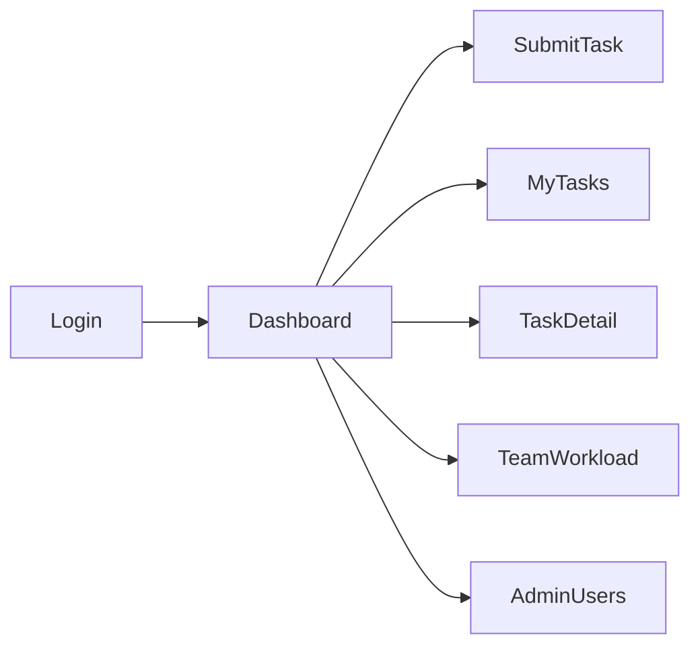

# 7. Frontend Architecture

**Source:** [specification-extract.md](specification-extract.md) — *simple user interface* for **task submission** and **status monitoring**. Spec lists HTML/CSS/JavaScript; implementation uses **React + TypeScript + Vite** (modern JS UI, same role).

## 7.1 Design principles

| Principle | Application |
|-----------|-------------|
| Simplicity | Minimal pages; no complex board UI |
| Clarity | Status, assignee, priority visible on list |
| Prototype focus | Submit → see automatic assignment outcome |
| Evaluation support | Admin/manager view for workload chart |

## 7.2 Information architecture



| Route | Role | Purpose |
|-------|------|---------|
| `/login` | public | Authenticate |
| `/` | all | Dashboard summary |
| `/tasks/new` | all | **Submit task** (FR-070) |
| `/tasks` | all | **Monitor status** (FR-071) |
| `/tasks/:id` | all | Detail + classification/routing summary |
| `/workload` | manager, admin | Distribution view (FR-050) |
| `/admin/users` | admin | User management |

## 7.3 Project structure

```
frontend/
├── src/
│   ├── main.tsx
│   ├── App.tsx
│   ├── api/
│   │   ├── client.ts           # fetch + auth header
│   │   └── types.ts              # aligned with OpenAPI
│   ├── auth/
│   │   ├── AuthContext.tsx
│   │   └── ProtectedRoute.tsx
│   ├── features/
│   │   ├── tasks/
│   │   │   ├── TaskSubmitForm.tsx
│   │   │   ├── TaskList.tsx
│   │   │   └── TaskDetail.tsx
│   │   ├── workload/
│   │   │   └── WorkloadChart.tsx
│   │   └── admin/
│   │       └── UserTable.tsx
│   ├── components/ui/            # shared buttons, inputs, badges
│   └── lib/utils.ts
├── index.html
├── vite.config.ts
├── tsconfig.json
└── Dockerfile
```

## 7.4 State management

| Concern | Solution |
|---------|----------|
| Server data | TanStack Query (tasks, workload, users) |
| Auth session | Context: access token in memory; refresh via httpOnly cookie or stored refresh per backend design |
| Forms | React Hook Form + Zod validation |

## 7.5 Key screens

### Task submission (FR-070)

Fields: title, description, intake channel (select: manual/form/email/internal), optional deadline.

On success: navigate to detail showing auto-assigned employee, category, priority, routing explanation summary.

### Task list (FR-071)

Columns: title, status, priority, assignee, created date. Filters: status, my tasks vs all (role-based).

### Task detail (FR-072)

Sections:

- Status timeline (open → assigned → …)
- NLP: category, confidence, predicted priority
- Routing: assigned user, score breakdown (friendly labels from `rationale` JSON)
- Comments (optional)
- Manager: “Reassign” button

### Team workload (FR-050)

Bar chart or table: employee name, active count, effort sum.

## 7.6 API integration

- Base URL from `VITE_API_URL`
- Attach `Authorization: Bearer` on protected routes
- Error toast from standard API error envelope

## 7.7 Styling

- Tailwind CSS + accessible component primitives (e.g. shadcn/ui pattern)
- Status colors consistent: open=gray, assigned=blue, in_progress=amber, completed=green
- No heavy customization — prioritize clarity for evaluators

## 7.8 Accessibility

- Form labels and `aria-invalid` on errors
- Keyboard navigable submit flow
- WCAG 2.1 Level A target (NFR-071)

## 7.9 Build and delivery

- Dev: Vite dev server proxy to API
- Prod: `npm run build` → static files served by nginx container in Docker Compose

## 7.10 Assumptions

| ID | Item |
|----|------|
| A-FE-01 | English UI only v1 |
| A-FE-02 | No offline/PWA requirement |
