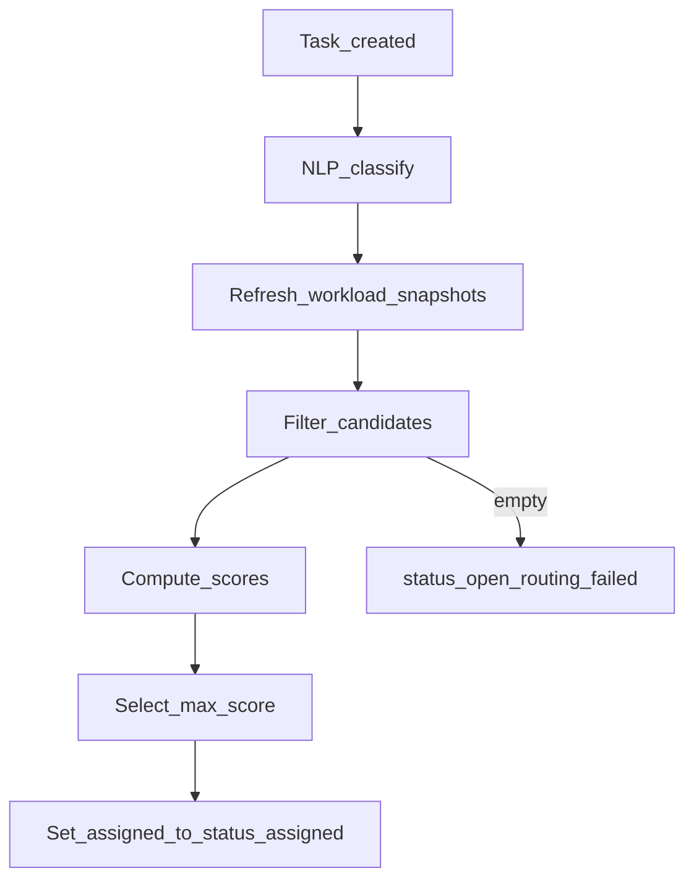

# 9. Workload Optimization Algorithm

**Source:** [specification-extract.md](specification-extract.md) - assign to **most suitable employee** based on **workload and task priority**.

## 9.1 Objectives

| Objective | Description |
|-----------|-------------|
| **Minimize imbalance** | Avoid assigning to already overloaded employees |
| **Respect priority** | Critical/high tasks favor available capacity |
| **Explainability** | Store rationale JSON for thesis and UI (FR-042) |
| **Automation** | Run on every intake without manual step (FR-040) |

## 9.2 Inputs and outputs

**Inputs:**

- Task: `priority`, `effort_points`, `department_id`, optional required skills from classification
- Candidates: active users in department with `active_task_count`, `effort_sum`, `max_active_tasks`

**Outputs:**

- `recommended_user_id`, `score`, `rationale` JSON, `processing_time_ms`

## 9.3 Workload model (Module M3)

```
active_load(u) = count(tasks where assigned_to=u and status in ('assigned','in_progress'))
effort_load(u) = sum(effort_points) for those tasks
normalized_load(u) = active_load(u) / max_active_tasks(u)
```

Snapshot stored in `workload_snapshots` before each routing decision.

## 9.4 Scoring function

For each candidate user `u` and task `t`:

```
skill_match(u, t) = 1.0  # v1 default if skills not used; else Jaccard(skills_u, skills_t)

load_factor(u) = 1 - normalized_load(u)

priority_weight(t) = { low: 1.0, medium: 1.1, high: 1.25, critical: 1.5 }

score(u, t) = w1 * skill_match + w2 * load_factor + w3 * priority_weight(t) - w4 * overload_penalty
```

Where:

```
overload_penalty = max(0, normalized_load(u) - 0.8) * 2
```

**Default weights (tunable via config):** w1=0.2, w2=0.5, w3=0.3, w4=1.0

## 9.5 Constraints (hard filters)

| Constraint | Action |
|------------|--------|
| User inactive | Exclude |
| `active_load >= max_active_tasks` | Exclude |
| Wrong department | Exclude (unless `ROUTING_ALLOW_CROSS_DEPT=true`) |
| No candidates | Return `routing_status=failed` |

## 9.6 Algorithm selection

### Primary: Greedy best-fit (prototype default)

1. Filter eligible candidates
2. Compute `score(u, t)` for each
3. Select `argmax score`
4. Tie-break: lowest `active_load`, then earliest `user.created_at`

**Rationale:** Simple, fast (< 1s for 50 users), easy to defend in diploma viva.

### Alternative: Hungarian algorithm (batch)

- Use when routing **multiple open tasks at once** (evaluation batch mode)
- Cost matrix `C[i,j] = -score(user_j, task_i)`
- `scipy.optimize.linear_sum_assignment` - document as optional Phase 6 experiment

### Future: OR-Tools CP-SAT for complex constraints - out of prototype scope

## 9.7 Automatic routing flow



## 9.8 Rationale JSON schema

```json
{
  "algorithm": "greedy_best_fit_v1",
  "weights": { "w1": 0.2, "w2": 0.5, "w3": 0.3, "w4": 1.0 },
  "candidates_evaluated": 8,
  "winner": {
    "user_id": "uuid",
    "score": 0.87,
    "skill_match": 1.0,
    "normalized_load": 0.3,
    "priority_weight": 1.25
  },
  "runner_up": [
    { "user_id": "uuid2", "score": 0.81, "normalized_load": 0.5 }
  ]
}
```

## 9.9 Distribution efficiency evaluation (FR-080)

**Procedure:**

1. Seed team with uneven manual assignments (baseline)
2. Run batch auto-routing on N new tasks
3. Compute `std_dev(active_load)` before and after
4. Report `% improvement`

Optional: Gini coefficient on load vector.

## 9.10 Manual override

Manager `PATCH /tasks/{id}/assignee`:

- Set `routing_decisions.status = overridden`
- Update `assigned_to_id`
- Refresh workload snapshots

## 9.11 Processing time (FR-045)

Log wall-clock for scoring loop only (exclude DB commit) in `routing_decisions.processing_time_ms`.

## 9.12 Assumptions

| ID | Item |
|----|------|
| A-RT-01 | Homogeneous employees within department if skills not modeled |
| A-RT-02 | Effort defaults to 1 if not provided on intake |
