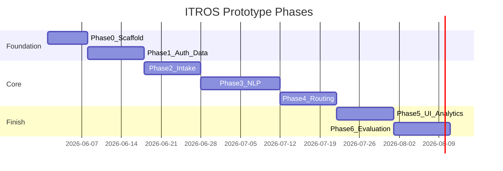

# 11. Development Roadmap

**Source:** [specification-extract.md](specification-extract.md) - prototype with evaluation on distribution efficiency, processing time, and accuracy.

Phases align with four specification modules plus evaluation harness.

## 11.1 Phase overview

## 11.2 Phase 0 - Repository and platform

| Item | Deliverable |
|------|-------------|
| Repo structure | `backend/`, `frontend/`, `docs/`, `docker-compose.yml` |
| GitHub | Remote `https://github.com/unclesam13/ITROS-Project`; `.gitignore`; see [github-workflow.md](github-workflow.md) |
| Docker | Postgres + API + frontend healthy |
| Tooling | Ruff, pytest, ESLint, `.env.example` |
| CI | Lint on push (optional GitHub Actions) |

**Exit:** `docker compose up` → `/health` OK.

## 11.3 Phase 1 - Auth, users, database

| Item | Deliverable |
|------|-------------|
| Alembic | Initial schema per doc 05 |
| JWT auth | Login, refresh, RBAC deps |
| Admin seed | admin, manager, employee users |
| API | Users, departments CRUD |

**Exit:** Role-enforced endpoints; login from Postman.

**Maps to:** FR-001–005, FR-003.

## 11.4 Phase 2 - Task intake and monitoring (Module M1)

| Item | Deliverable |
|------|-------------|
| POST /tasks | Persist task without ML (status `open`) |
| GET/PATCH tasks | Status workflow |
| Frontend | Submit form + task list + detail |
| Intake channel | Enum on task |

**Exit:** User submits task and tracks status in UI.

**Maps to:** FR-015–025, FR-070–071.

## 11.5 Phase 3 - NLP classification (Module M2)

| Item | Deliverable |
|------|-------------|
| Labeled dataset | `ml/data/labeled_tasks.csv` |
| train.py | TF-IDF + sklearn → joblib |
| Pipeline | Auto-classify on intake |
| Metrics | Test set F1 report |

**Exit:** New tasks receive category + priority; `processing_time_ms` logged.

**Maps to:** FR-030–034, FR-082 (classification part).

## 11.6 Phase 4 - Workload and routing (M3 + M4)

| Item | Deliverable |
|------|-------------|
| WorkloadService | Snapshots on assign/status change |
| RoutingService | Greedy scorer + auto-assign on intake |
| Rationale JSON | Stored and shown in UI |
| Override | PATCH assignee |

**Exit:** End-to-end automatic pipeline on submit.

**Maps to:** FR-035–045, FR-040–042.

## 11.7 Phase 5 - Simple UI completion and workload view

| Item | Deliverable |
|------|-------------|
| Workload page | Chart/table for managers |
| Routing summary | Human-readable on task detail |
| Admin UI | User management |
| Polish | Error states, loading states |

**Exit:** Spec “simple UI” fully demonstrated.

**Maps to:** FR-050, FR-072, NFR-070.

## 11.8 Phase 6 - Evaluation and thesis artifacts

| Item | Deliverable |
|------|-------------|
| `evaluation/run` script | Batch tasks, compute FR-080–082 |
| `docs/evaluation-results.md` | Actual metric numbers |
| README | Setup, demo script, architecture link |
| Tests | Service + API coverage targets |
| Demo video script | 5-minute walkthrough |

**Exit:** Three specification metrics documented with reproducible commands.

**Maps to:** FR-080–082, NFR-090–092.

## 11.9 Parallel workstreams

| Stream | Phases |
|--------|--------|
| Backend | 0 → 1 → 2 → 3 → 4 → 6 |
| Frontend | 0 → 1 (login) → 2 → 5 |
| ML | 3 → 6 (evaluation) |

## 11.10 Risk buffer

| Risk | Mitigation week |
|------|-----------------|
| Low NLP accuracy | Extra labeling in Phase 3 |
| Routing edge cases | Manual override + failed status in Phase 4 |
| Docker issues | Phase 0 hardening |

## 11.11 Definition of done (prototype)

- [x] All Must FRs from doc 02 implemented
- [x] Evaluation report with three metric families - [evaluation-results.md](evaluation-results.md)
- [x] Docker demo for committee - [demo-video-script.md](demo-video-script.md)
- [x] Architecture docs approved (this package)

## 11.12 Status

Architecture approved. **Phases 0–6** implemented. Evaluation harness: `backend/scripts/run_evaluation.py`, API `/evaluation/*`, tests in `backend/tests/test_evaluation*.py`.
