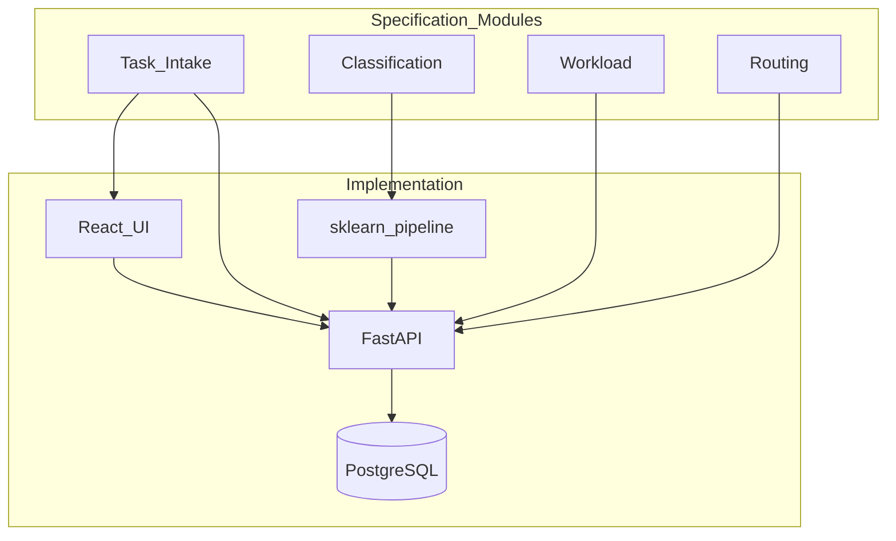

# 12. Technology Stack

**Source:** [specification-extract.md](specification-extract.md)  
**Implementation choices:** Author-selected modern stack (unchanged); mapped to specification requirements.

## 12.1 Specification vs implementation

| Specification | ITROS implementation | Justification |
|---------------|----------------------|---------------|
| Python | Python 3.12 | Core + NLP per spec |
| Flask or FastAPI | **FastAPI** | Async-ready, OpenAPI, type hints |
| SQLite or PostgreSQL | **PostgreSQL 16** | Closer to real office deployments; concurrent demo users |
| Scikit-learn | **scikit-learn** (primary ML) | Spec: interpretable academic models |
| HTML, CSS, JavaScript | **React 18 + TypeScript + Vite** | Modern JS UI; satisfies presentation layer |
| Git | Git | Version control |
| - | **spaCy, sentence-transformers** | Optional preprocess / embeddings → sklearn (enhancement) |
| - | **Docker, Docker Compose** | Reproducible prototype deployment |
| - | **JWT** | Secure API auth for SPA |

## 12.2 Backend

| Component | Technology | Version (target) |
|-----------|------------|------------------|
| Runtime | Python | 3.12 |
| Framework | FastAPI | ≥ 0.110 |
| ORM | SQLAlchemy | 2.x |
| Migrations | Alembic | ≥ 1.13 |
| Validation | Pydantic | v2 |
| Auth | python-jose / PyJWT + passlib[bcrypt] | - |
| Server | Uvicorn | ≥ 0.27 |
| Testing | pytest, httpx | - |
| Lint | Ruff, mypy | - |

## 12.3 Machine learning

| Component | Technology | Role |
|-----------|------------|------|
| Classification | scikit-learn | **Required** - TF-IDF + LinearSVC/LogisticRegression |
| Preprocessing | spaCy `en_core_web_sm` | Optional tokenization |
| Embeddings | sentence-transformers | Optional feature path |
| Serialization | joblib | Model artifacts |
| Evaluation | sklearn.metrics | FR-082 |

## 12.4 Frontend

| Component | Technology |
|-----------|------------|
| UI library | React 18 |
| Language | TypeScript 5 (strict) |
| Build | Vite 5 |
| Routing | React Router 6 |
| Server state | TanStack Query 5 |
| Forms | React Hook Form + Zod |
| Styling | Tailwind CSS 3 |
| Components | shadcn/ui pattern (Radix primitives) |

## 12.5 Data and infrastructure

| Component | Technology |
|-----------|------------|
| Database | PostgreSQL 16 |
| Containers | Docker 24+, Compose v2 |
| Reverse proxy (prod demo) | nginx (frontend static) |

## 12.6 Modular architecture mapping (spec)



## 12.7 Docker Compose layout (planned)

```yaml
# Conceptual services
services:
  db:
    image: postgres:16-alpine
  api:
    build: ./backend
    depends_on: [db]
  frontend:
    build: ./frontend
    depends_on: [api]
```

Volumes: `pgdata`, optional `ml_models` mount.

## 12.8 Alternatives considered

| Area | Alternative | Why not primary |
|------|-------------|-----------------|
| Backend | Flask | Fewer built-in types/OpenAPI |
| DB | SQLite | Weaker concurrency for evaluation batches |
| ML | Pure deep learning | Less interpretable for diploma thesis |
| UI | Plain HTML templates | Harder to maintain rich task UI |
| Routing | OR-Tools | Overkill for prototype greedy algorithm |

## 12.9 Dependency management

| Layer | File |
|-------|------|
| Python | `backend/pyproject.toml` or `requirements.txt` with pins |
| Node | `frontend/package.json` lockfile |

## 12.10 Development environment

| Tool | Purpose |
|------|---------|
| Docker Desktop (Windows) | Local Compose |
| VS Code / Cursor | IDE |
| pgAdmin or DBeaver | DB inspection (optional) |

## 12.11 Assumptions

| ID | Item |
|----|------|
| A-STK-01 | No cloud deployment required for diploma; local Compose sufficient |
| A-STK-02 | Team stack additions (spaCy, sentence-transformers, React) do not conflict with specification intent |
